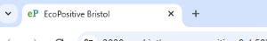
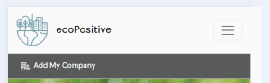
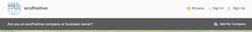
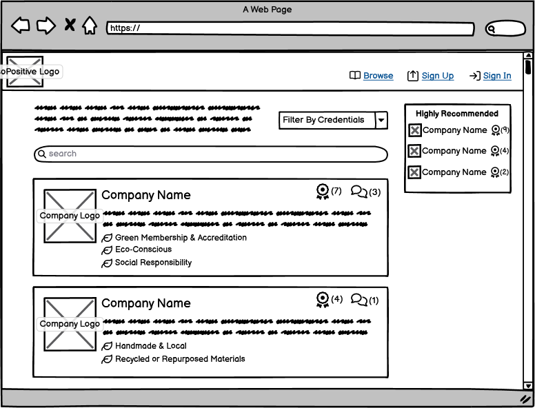
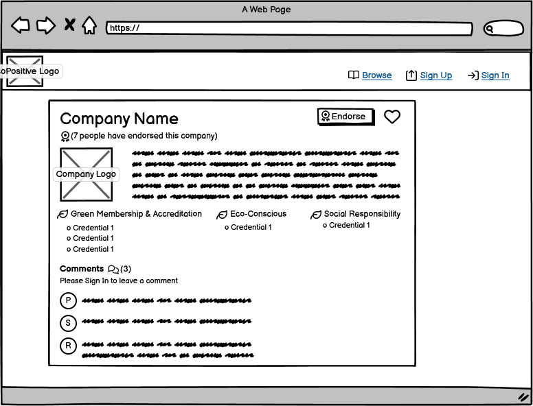

# EcoPositive Bristol (REACT UI)

[EcoPositive Bristol](https://tastesensation-pp4-54d01fbc1628.herokuapp.com/) is a one stop business listing championing Bristol’s eco-conscious and socially responsible companies.

Users are invited to sign up to endorse the companies that they support and comment on listed businesses so that other visitors to the site can see which businesses are popular.

## Features

### Site Wide

***Favicon***

- A favicon with the letter eP in different green tones to represent two parts of the name 'eco' and 'Positive'.

***Nav Bar***

- Navigation bar with clear brand heading and logo for ecoPositive.
- Includes links for easy navigation around the site. Only links that are accordante with user role and authentication are displayed for better user experience.
- Fully responsive with navigation links collapsable into a burger 'Menu' icon on smaller deviced to keep layout clean and uncluttered.

- **Logged Out Links**

    The links that are visible to all users when not logged in are:

    - Browse - Links to 'home' page where all users can view a list of companies with basic info.
    - Sign in - Links to the sign in form
    - Sign up - Links to the Sign up form

- **Logged In Links**

    The links that are visible to authenticated users when logged in are:

    - Browse - Links to 'home' page where all users can view a list of companies with basic info.
    - Log out - Enables the current logged in user to log out.
    - My ecoPositive - Links to the current user's profile details and personalised list of endorsed companies
    - Contact - Links to a contact form

***Add Company Banner***

- A banner message using Bootstrap NavBar styling to enable a user to add their own company to the site.
- Links to CompanyCreateForm where a logged in user can add company details and submit them for approval.
- Banner visible on all pages whether logged in or not so company owners can easily see how to add their own company from whichever page they are on.
- Tooltip used to highlight that users must be logged in to add their own company.

***Three Dots Dropdown***

- A drop down menu visible to specific authenticated users to enable an item to be edited / deleted.
- Three dots indicate a hidden 'more' menu and when clicked display two icons to edit or delete.
- The edit icon calls the relevant 'handleEdit()' method for that particular item instance.
- The edit icon calls the relevant 'handleDelete()' method for that particular item instance.

***Asset***

- Spinning wheel component to be added anywhere that data is to be loaded so user sees spinning wheel until everything has ben mounted and rendered.

***Avatar***

- Component to display the logged in user's avatar next to their profile link in the navbar and anywhere that their profile details are displayed (such as comments).
- Sets standard avatar image size and layout for consistencey across the site.

### Company Directory (CompanyListPage.js)

- A page / view to list of all companies in the directory providing a brief overview of each company.
- List can be filtered by:
    - Eco-credentials groups
    - Endorsed companies
- A search bar enables the user to search for companies by key word, description or name.
- Bottomless scrolling so users can view as many companies as they wish and encourages ongoing engagement.

- ***Company List Component (CompanyList.js)***

    - Snapshot of company information including company name, logo and a brief description.
    - Includes Endorsement Count and Comment Count to provide users with snapshot of company popularity and activity.
    - Displays group headings for any eco-credentials assigned to that company.
    - Logo and Company name link to the Company Page (CompanyPage.js) for further information.

### Company Page (CompanyPage.js)

- Parent page to display more information on a particular company.

The Company Page provides a framework for a number of components:

- ***Company Component (Company.js)***

    - Renders company information in responsive layout including:

        - Company name
        - Company logo
        - Brief description to describe what the company does
        - Additional information on the ethos and activities of the company
        - Endorsements Count
        - Comments Count
    - The company name and logo both link directly to the company's own website in a new tab.

- ***Credentials Component (Credentials.js)***

    - Displays any eco-credentials that have been assigned to the company.
    - Credentials are listed under the relevant credential group
    - Each credential features a leaf icon instead of a bullet point to reinforce environmental focus.

- ***Add/Edit Credentials Button***

    - Button only visible if the current logged in user is also the company owner (the person who submitted the company to be listed).
    - When clicked, the button updates a showForm state from the default 'false' to 'true', enabling a form to display.
    - When clicked again, the button updates the showForm state back to 'false' so that the form is no longer displayed.

- ***Credential Select Form (CredentialSelectForm.js)***

    - If the current logged in user is also the company owner, they can click on the Add/Edit credentials button to display the form.
    - Credentials are listed in four separate drop down menu input fields under each of the four eco-credential groups.
    - Once a credential has been selected, the owner clicks on 'Add credential' to add the credential to their company. 
    - A selected credential can also be removed from a company listing by clicking on the 'remove credential' button.
    - Each time a credential is added / removed the company page refreshes so that the list of credentials is updated with the latest information and the owner can see that the selected credential has been added / removed.

- ***Add Comment Form***

- ***Comment List***

    Some information on the Comments List

    - **Comment Owner**
    When logged in as the owner of the comment ......

    

    - **Casual User**
    When viewing as a casual user......

    

### Add Company Form (CompanyCreateForm.js)

- Info

### Edit Company Form (CompanyEditForm.js)

- Info

### Design Process

***Wireframes***

- Initial Wireframe designs were used to plan out the layout for the CompanyList and CompanyPage. These views are visible to all users whether logged in or not.

***Models***

- The next step was to plan and devise an ERD for each of my database models and a schema to map out and understand the relationships between them. I created an ERD and model schema for the project based on all of the elements that I would like to include if I was able (this included the Should Have and Could Have User Story issues).

You can view all ERDs and the full schema in the README for the drf API part of the EcoPositive project.

## Testing

### Automated Testing

### Manual Testing
