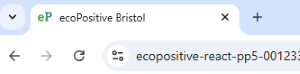
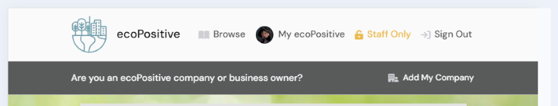
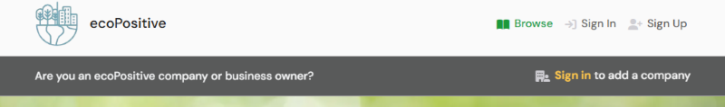
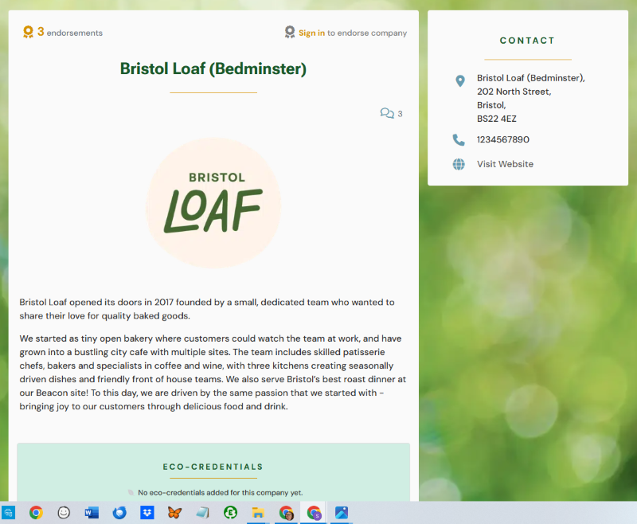

# EcoPositive Bristol (REACT UI)

[ecoPositive Bristol](https://ecopositive-react-pp5-0012331e7023.herokuapp.com/) is a one stop directory championing Bristol’s eco-conscious and socially responsible businesses.

Unlike other business directories, ecoPositive is focused on highlighting the environmental awareness and community engagement of a company's actions and ethos.

This is good for the company owner as this information is often buried in a website and not at the forefront of their profile or reputation.

Business owners are invited to list their company or business and highlight their eco-positive credentials from a list of 50 pre-determined options listed under group headings.

All users are able to view the directory and see the company details so they can quickly identify local companies that align with their own ecoPositive priorities whether they sign up or not.

Users are invited to sign up to endorse the companies that they support and comment on listed businesses so that other visitors to the site can see which businesses are popular.

All listed companies and businesses are held accountable by the community / customers / clients as users can choose to endorse companies that they have personal experience of, and comment on the company profile if they do not agree with the eco-credentials or description that the company has posted.

The goal of this REACT user interface is to provide an engaging and user-friendly front end website that users can interact wih in order to create, read, update and delete data in the [back end API](https://ecopositive-api-pp5-ba0d580957dc.herokuapp.com/admin/) and to ensure they get the most out of the site.

## Features

### Site Wide & Reusable React Components

This project leverages a modular approach by creating and reusing various React components to build the application's front-end efficiently. Below is a list of reusable components, along with descriptions and their usage within the application.

***Favicon (site wide)***

- A favicon with the letter eP in different green tones to represent two parts of the name 'eco' and 'Positive'.
- Usage:
    - Used across the entire application at the top level

***Nav Bar (components/NavBar.js)***

- Navigation bar with clear brand heading and logo for ecoPositive.
- Includes links for easy navigation around the site. Only links that are accordante with user role and authentication are displayed for better user experience.
- Fully responsive with navigation links collapsable into a burger 'Menu' icon on smaller deviced to keep layout clean and uncluttered.
- Links are grey when not in use and coloured green when 'active' to help users identify where they currently are in the site.
- Usage:
    - Used across the entire application at the top level

- **Logged Out Links**

    The links that are visible to all users when not logged in are:

    - Browse - Links to 'home' page where all users can view a list of companies with basic info.
    - Sign In - Links to the sign in form
    - Sign Up - Links to the sign up form

- **Logged In Links**

    The links that are visible to authenticated users when logged in are:

    - Browse - Links to 'home' page where all users can view a list of companies with basic info.
    - Sign Out - Enables the current logged in user to log out.
    - My ecoPositive - Links to the current user's profile details and personalised list of endorsed companies

Additional links that are visible to authenticated users with admin status when logged in:

  - **Staff Only** - Links to admin page for admin staff to approve new companies and review reported comments

***Add Company Banner (components/AddCompany.js)***

- A banner message using Bootstrap NavBar styling to enable a user to add their own company to the site.
- Links to CompanyCreateForm where a logged in user can add company details and submit them for approval.
- Banner visible on all pages whether logged in or not so company owners can easily see how to add their own company from whichever page they are on.
- Conditional rendering used to highlight that users must be logged in to add their own company.
- Usage:
    - Used across the entire site at the top level

  

***Three Dots Dropdown (components/DotsDropdown.js)***

- A drop down menu conditionally rendered to authenticated users identified as the instance owner to enable an item to be edited / deleted.
- Three dots indicate a hidden 'more' menu and when clicked display two icons to edit or delete.
- The edit icon calls the relevant 'handleEdit()' method for that particular item instance.
- The edit icon calls the relevant 'handleDelete()' method for that particular item instance.
- Usage:
    - Company.js - to enable company owner to edit / delete the company instance
    - Comment.js - to enable the comment owner to edit / delete the comment instance
    - ProfilePage.js - to enable the profile owner to edit / delete the profile

***Asset (components/Asset.js)***

- Spinning wheel component to be added anywhere that data is to be loaded so user sees spinning wheel until everything has been mounted and rendered.
- Usage:
  - CompanyList.js
  - CompanyListPage.js
  - CompanyPage.js
  - Credentials.js
  - CredentialSelectForm.js
  - ProfilePage.js
  - TopCompanies.js

***Avatar (components/Avatar.js)***

- Component to display the logged in user's avatar next to their profile link in the navbar and anywhere that their profile details are displayed (such as comments).
- Sets standard avatar image size and layout for consistencey across the site.
- Where no avatar has been submitted, a default plank profile icon is used.
- Usage:
  - Navbar - authenticated users will see their avatar in the navbar next to the My ecoPositive link.
  - Comments - the avatar is displayed next to a user's comments.

### Company Directory (CompanyListPage.js)

- The main 'home' page listing all companies in the directory providing a brief snapshot of each company which links to the company details.
- A search bar enables the user to search for companies by name, excerpt, key words or eco-credential group.
- Bottomless scrolling so users can view as many companies as they wish and encourages sustained engagement.

- ***Company List Component (CompanyList.js)***

    - Bootstrap card rendered for each company providing a snapshot including: 
      - Company name, 
      - Company logo
      - Brief description
      - Endorsement count
      - Comment count
      - Group headings relating the the credentials assigned to the company
    - Logo and Company name link to the Company Page (CompanyPage.js) for further information.

    

### Company Page (CompanyPage.js)

- Parent page to display more information on a particular company.

    

The Company Page provides a framework for a number of components:

- ***Company Component (Company.js)***

    - All casual users when not logged in can see the company details.
    - Conditional rendering displays a message to not logged in users that they need to sign in to endorse a company.
    - The Company component renders company information with fully reponsive styling. 
    - All users can view:
        - Company name
        - Company logo
        - Brief description to describe what the company does
        - Additional information on the ethos and activities of the company
        - Endorsements Count
        - Comments Count
    - The company name and logo both link directly to the company's own website in a new tab.

    - **Company Component as Authenticated Users**
      - When logged in, conditional rendering is used to display the 'Endorse Company' button to authenticated users who are not the company owner.

      - When an authenticated user clicks on the Endorse Company button, the endorsement count increases by 1 and the button changes format to become the 'Remove Endorsement' button.

      - Each authenticated user is only allowed to endorse a particular company instance once. This is also set as a unique_together contraint within the Endorsement data model.

    

    

- **Company Component as Owner**
  - For each company page, conditional rendering is used to check if the current authenticated user is the owner of the comapny.
  - The company owner will not see the 'Endorse Company' button as the owner is not allowed to endorse their own company.
  - If is_owner is true, the owner will see the three dots dropdown menu to enable them to edit or delete the company.
  - Clicking on the edit icon takes the owner to the ComapnyEditForm (see below section)
  - Clicking on the delete icon renders a modal asking the user to confirm that they want to delete the company.

  

  

- ***Company Contact Details (CompanyContact.js)***

    - Renders company contact details in responsive layout including:

        - Company address
        - Company telephone number
        - Company website link
    
    If there are no address / phone / website details conditional rendering displays a message to the user.

    

    

    
- ***Credentials Component (Credentials.js)***

    - Displays any eco-credentials that have been assigned to the company.
    - Credentials are listed under the relevant credential group
    - Each credential features a leaf icon instead of a bullet point to reinforce environmental focus.

    

- ***Add/Edit Credentials Button***

    - Button only visible if the current logged in user is also the company owner (the person who submitted the company to be listed).
    - When clicked, the button updates a showForm state from the default 'false' to 'true', enabling a form to display.
    - When clicked again, the button updates the showForm state back to 'false' so that the form is no longer displayed.

    

- ***Credential Select Form (CredentialSelectForm.js)***

  - **Add Credentials**
      - If the current logged in user is also the company owner, they can click on the Add/Edit credentials button to display the form.
      - Credentials are listed in four separate drop down menu input fields under each of the four eco-credential groups.
      - The owner can select as many credentials from the groups lists as they wish by holding down Ctrl.
      - Clicking on 'Add Credentials' adds the credentials to their existing list of credentials.
      - Once submitted, the company page refreshes so that the list of credentials is updated with the latest information and the owner can see that the selected credentials have been added.
      - Clicking 'X Cancel' closes the form again.

    

  - **Remove Credentials**
      - The remove credentials form lists all of the credentials currently assigned to that company instance.
      - The company owner can select as many credentials as they wish my holding down Ctrl.
      - Clicking on 'Remove Credentials' removed the credentials from the existing list of credentials.
      - Clicking 'X Cancel' closes the form again.    

    

- ***Add Comment Form (CommentCreateForm)***

  - Authenticated users can comment on any company. 
  - Company owners are allowed to comment on their own companies so that they can respond to other user comments.
  - Conditional rendering is used to only display the CommentCreateForm to authenticated users.

  

- ***Comments***

  - All users are able to view all comments left for a company, however there are a few additional elements that are only rendered to users according to their authentication role.
  - Infinite Scrolling ensures that users can view all comments made for a particular company if they wish to.
  - Every user, regardless of authentication or logged in status will see:
    - Username of commenter
    - Avatar of the commenter (or default profile image if not updated)
    - Comment content
    - Time passed since the comment was created

- **Casual Users**
    When viewing as a casual user who is not logged in, the user can see the list of comments and a message to prompt them to log in to leave a comment of their own.

    

- **Authenticated User**
    - When logged in, authenticated users can see all of the above content, and the comment create form.
    - In addition, they can see a flag icon and label enabling them to report that particular comment if they wish.

    

    - All comments are not reported by default. Clicking on the flag of an unreported comment displays two buttons to report the comment or not.

    

    - Once a comment is reported, the flag turns red and the message states 'Comment Reported'.
    - Clicking on the flag of a reported comment displays the message: 'This comment is being reviewed by ecoPositive staff'.

    
    
- **Comment Owner**
  - When logged in as the owner of the comment instance, the user sees all of the the above and the three dots dropdown menu which includes a handleEdit and handleDelete function.
  - Clicking on the flag of an unreported comment as the owner displays the message: 'You cannot report your own comment' instead of rendering the report buttons.
  - Clicking on the flag of a reported comment as the comment owner displays the message: 'Your comment has been reported, you may wish to edit or delete this comment'.

  

  

  - Clicking on the edit icon renders the CommentEditForm which is pre-populated with the comment content and two buttons to 'Save' or 'X Cancel'.

  - Clicking on the save button updates the comment and a popup message confirms that the comment has been updated successfully.

  - Clicking on the delete icon in the drop down renderd a modal asking the user to confirm that they definitely want to delete the message.

  

  

  
    

### Add Company Form (CompanyCreateForm.js)

- Any authenticated user can submit a company to be considered for addition to the ecoPositive directory.
- Conditional rendering will only display the Add My Company link in the AddCompany banner if a user is logged in.
- A useRedirect(loggedOut) hook at the top of the form function provides defensive authorisation sending unauthenticated users back to the home page if they try to access the from from the url.
- Clicking on the Submit Company button creates the company in the api and redirects the user to the associated company detail page so they can add their company credentials.
- New companies are not approved and so are not included in the home page listing which only displays companies that have been approved for listing.
- Unapproved companies can be viewed by the company owner so they eco-credentials can be added without having to wait for the approval process to be completed. If they navigate away from the initial company page redirect, the new company will be accessible from their profile page.

### Edit Company Form (CompanyEditForm.js)

- Conditional rendering displays  

### My ecoPositive Profile ()

### Edit Profile Form ()

### Admin Page ()

### Page Not Found ()

### Future Features

## UX Design
    - Colour Palette
    - Background Image
    - Typography
    - Icons

## Design Process

### User Stories

### Agile Methodology

### Data

***Models***

- The next step was to plan and devise an ERD for each of my database models and a schema to map out and understand the relationships between them. I created an ERD and model schema for the project and the data structured required for the UI to work.

You can view all ERDs and the full schema in the [back end ecoPositive API](https://ecopositive-api-pp5-ba0d580957dc.herokuapp.com/admin/) README.

***User Authentication***

Throughout the site, conditional rendering and fetchData filtering methods are used to ensure that the content rendered is accordant with the authentication profile for that user.

There are three main user authentication levels:
- **Casual User**
    - Any user who visits the site and is not logged in.
- **Authenticated User**
    - A user who has signed up to the site and successfully logged in.
- **Authenticated Admin**
    - An authenticated user who has been given is_staff status in the api admin dashboard (accessible by superusers only).

In addition to the above general authentication levels: 
- **is_owner**
    - Checks if the current authenticated user is the owner of that particular instance. Conditional rendering is then used to display elements which are only accessible by the instance owner.

### Wireframes

- Initial Wireframe designs were used to plan out the layout for the CompanyList and CompanyPage. These views are visible to all users whether logged in or not.

## Testing

### Automated Testing

### Manual Testing
